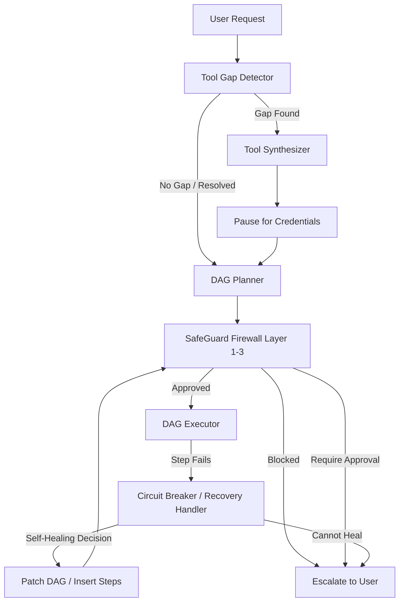

# MOIRA: Multi-Tenant Agentic MCP Gateway & Fate Engine
## Comprehensive Project Documentation & Submission Details

This document provides a highly detailed, technical overview of **MOIRA (Model Orchestrated Integration & Recovery Agent)**, also known as the **MCP Gateway & Fate Engine**. It covers the architecture, core data flows, security firewalls, and self-healing orchestration loops that power this system.

---

## 1. Working MVP & Demo Evidence

*   **Production Application Link**: [https://moira.sinaai.in](https://moira.sinaai.in)
*   **Production Backend API Link**: [https://moira-backend-ly1o.onrender.com](https://moira-backend-ly1o.onrender.com)
*   **Deployment Configuration**:
    *   **Frontend**: React (Vite + TypeScript) served statically from the backend to ensure zero-CORS relative routing.
    *   **Backend**: FastAPI running Python 3.11.9, hosted on Render.
    *   **Storage**: Supabase Postgres Database (multi-tenant isolated tables) + Render Redis (state management and queue processing).

---

## 2. GitHub Repository Details

*   **Repository Link**: [https://github.com/Gamertoy9354/MOIRA](https://github.com/Gamertoy9354/MOIRA)
*   **Setup Instructions**: Included in the repository's root `README.md`.
*   **Key Dependencies**:
    *   **Backend**: `fastapi`, `uvicorn`, `httpx`, `asyncpg`, `pydantic-settings`, `python-jose`, `openai`, `redis`.
    *   **Frontend**: `react`, `react-router-dom`, `framer-motion`, `recharts`, `@supabase/supabase-js`.
*   **Environment Note**: Mode selection (local mock vs. cloud production) is determined dynamically based on the existence of Supabase keys in environment variables, allowing the application to function in local offline development automatically.

---

## 3. Under-the-Hood Explanation: Request Data Flow

When a user enters a prompt, such as: *"Create a hotfix branch on GitHub, log the ticket details in a Google Sheet, and ping the team on Slack,"* the MOIRA engine executes a highly structured pipeline:



### Step 3.1: Tool Gap Detection & Analysis
Before planning the execution steps, the request is parsed by the **Tool Gap Detector** (`backend/core/tool_gap_detector.py`).
*   The system uses the **Kimi K2.5** model (via NVIDIA NIM) to extract all distinct service intents from the request (e.g., "send email", "post to slack").
*   It compares these intents against the available tool signatures in the `ConnectorRegistry`.
*   If a tool intent has no matching registered connector, the **Tool Synthesizer** is triggered to write a new connector class on the fly.

### Step 3.2: Dynamic Tool Synthesis
If a gap is found (e.g., using SendGrid to send emails when no SendGrid connector exists):
1.  The **Tool Synthesizer** (`backend/core/tool_synthesizer.py`) sends a request to Kimi K2.5 with the abstract base class and a reference connector.
2.  Kimi K2.5 generates a production-ready Python connector subclass (e.g. `SendgridConnector`).
3.  The generated code is parsed with `ast.parse()` to ensure syntactic validity, and scanned by the **SafeGuard** regex engine for dangerous patterns (e.g. `subprocess`, `eval`, file writes outside sandbox, hardcoded secrets).
4.  If safe, the file is saved under `backend/connectors/synthesized/{service}.py` and hot-loaded into the running Python process's registry without requiring a server restart.
5.  The frontend displays a credentials modal, pausing execution until the user inputs the necessary API key/token.

### Step 3.3: DAG Planning (Directed Acyclic Graph)
The **Kimi Planner** (`backend/core/planner.py`) receives the user's intent and the list of available tools (both built-in and synthesized). It compiles them into a structured JSON execution plan (DAG):
*   Steps that do not depend on each other are planned with empty `depends_on` lists, allowing the executor to run them in **parallel**.
*   Data dependencies are mapped using a template variable syntax: `{{step_0.output.branch_name}}`.

### Step 3.4: SafeGuard Firewall (Three-Layer Inspection)
Before any step executes, it passes through the **MCPSafeGuard** (`backend/core/safeguard.py`):
1.  **Layer 1 (Perimeter)**: Verifies the tool is registered and the connector signature is correct.
2.  **Layer 2 (Policies)**: Checks conditions (e.g., blocking pushes to `main`/`master` without human approval, or blocking any tool containing `delete`/`destroy` in the name).
3.  **Layer 3 (Anomaly Detection)**: Scans input parameters for SQL injection and shell injection patterns, blocks payloads > 50KB, and prevents rate-abuse (more than 10 calls to the same tool in 60 seconds).

### Step 3.5: Self-Healing & Recovery
If a step fails (e.g. a Google Sheet ID is invalid or a GitHub branch already exists):
1.  The **Recovery Handler** (`backend/core/recovery.py`) halts the failed path while keeping other paths running.
2.  A **Circuit Breaker** records the failure. If the step has failed repeatedly, it escalates to a human operator.
3.  The failed step details, error log, and available tools are sent to Kimi K2.5.
4.  Kimi makes a recovery decision:
    *   `patch_dag`: Fixes wrong parameters (e.g. correcting a sheet name typo) and retries.
    *   `insert_steps`: Dynamically injects prerequisite steps (e.g., creating the Google Sheet first) and resumes execution.
    *   `escalate`: Asks for user intervention.

---

## 4. Value Beyond a Generic LLM

A generic LLM (ChatGPT, Claude, Gemini) cannot achieve this result because:
*   **Stateful Execution & Orchestration**: A standard chatbot cannot coordinate multi-step workflows, run independent actions in parallel, resolve template parameters dynamically, or manage connection state across multiple APIs.
*   **Model-Directed Code Generation (Synthesis)**: When faced with a missing tool, MOIRA writes, validates, and hot-injects its own integration code into the running application. A standard LLM can only output code for the user to copy-paste.
*   **The SafeGuard Firewall**: It actively protects APIs. If the planner produces a destructive action or is fed a shell command injection payload, the SafeGuard firewall blocks it at the gateway.
*   **Self-Healing Loop**: If a script or API call fails, the gateway self-heals by rewriting the plan mid-execution to circumvent the issue.
*   **Multi-Tenant Privacy**: User keys and environment variables are isolated at the database level and injected only at call-time using ContextVars.

---

## 5. Data Sources & References

*   **Supabase (PostgreSQL & GoTrue)**: Used for multi-tenant user authentication, profile creation, and workspace state storage.
*   **NVIDIA NIM & Kimi K2.5 (`moonshotai/kimi-k2.5`)**: The core cognitive LLM engine used for intent extraction, DAG compilation, code synthesis, and error recovery.
*   **GitHub REST API**: Connected via `httpx` to manage git repositories, issues, branches, and code commits.
*   **Jira Cloud REST API**: Used for issue creation, updating, and project tracking.
*   **Slack Web API**: Used for sending alerts and posting messages to channels.
*   **Google Sheets API**: Authenticated via service accounts to perform spreadsheet read, write, append, and styling operations.

---

## 6. Architecture & Technical Design

```
+-------------------------------------------------------------------+
|                        React (Vite) Frontend                      |
|  - Real-time WebSocket connection to follow DAG execution live    |
|  - Onboarding & Interactive MCPSettings Dashboard                |
+-------------------------------------------------------------------+
                                 |  HTTPS / WSS
                                 v
+-------------------------------------------------------------------+
|                       FastAPI Python Backend                      |
|  - AuthMiddleware: JWT parsing (HS256 secret or ES256 JWKS)       |
|  - DAG Executor: ThreadPoolExecutor executing tasks in parallel   |
|  - Tool Synthesizer: Code generator and AST / SafeGuard scanner  |
|  - Connection Pool: asyncpg for local Postgres / Supabase         |
+-------------------------------------------------------------------+
                                 |  
        +------------------------+------------------------+
        |                                                 |
        v                                                 v
+-----------------------+                         +---------------+
|     Supabase DB       |                         |  Redis Cache  |
|  - User Profiles      |                         |  - Workflow   |
|  - Env Configs        |                         |    States     |
|  - Onboarding Data    |                         |  - Locks      |
+-----------------------+                         +---------------+
```

---

## 7. Demo Scenario & Limitations

### Concrete Scenario: Incident Management Escalation
*   **Input**: *"We have a critical database failure. File a Jira bug, create a Sheet audit, and notify the team on Slack."*
*   **Processing**:
    1.  The Kimi Planner generates 3 steps: `jira.create_issue`, `sheets.append_row`, and `slack.send_message`.
    2.  `jira.create_issue` and `sheets.append_row` run in parallel.
    3.  `slack.send_message` depends on both completing, and formats its message using variables: `Jira Ticket {{step_0.output.key}} created and logged to Sheet {{step_1.output.title}}`.
*   **Output**: A Slack notification containing the active links to the created Jira issue and Google Sheet.

### System Limitations & Status:
*   **Fully Complete**: Supabase JWT authentication (HS256/ES256), settings sync, SafeGuard layer validation, AST code scans, and parallel DAG execution.
*   **Partially Mocked / In-Progress**: Synthesized tools currently support stateless HTTP operations. Stateful connectors that require persistent socket channels or Webhook setups are planned for future iterations.
